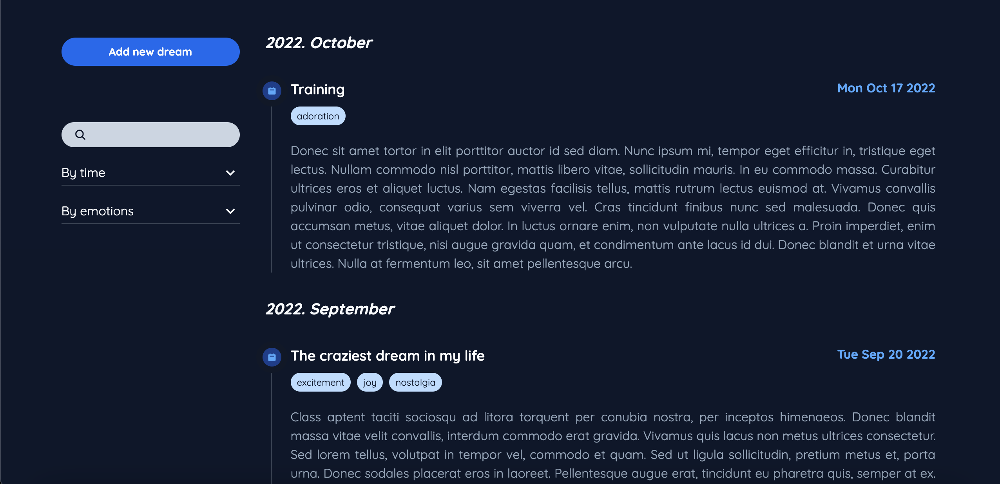
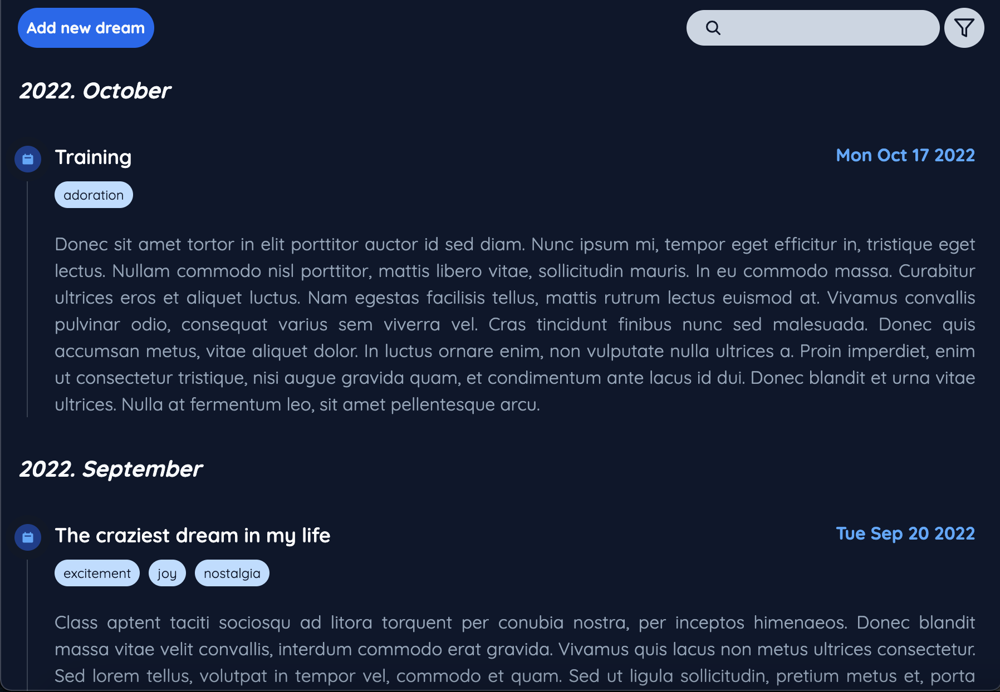
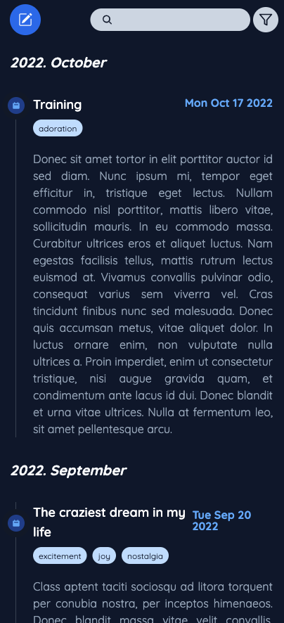

# Dream Journal

## Table of contents

- [The challenge](#the-challenge)
- [Screenshot](#screenshot)
- [Links](#links)
- [Built with](#built-with)
- [Continued development](#continued-development)
- [Author](#author)

## The project

This is a small frontend project where you can collect your dreams (with additional emotion tags). You can search by text, filter by time and by tags. It was designed to show the optimal layout for each page depending on the screen size

## Screenshot

Desktop:

Tablet:

Mobile:

## Links

- GitHub repo: [https://github.com/trbogi/dream-journal](https://github.com/trbogi/dream-journal)
- Live Site URL: [https://trbogi.github.io/dream-journal](https://trbogi.github.io/dream-journal)

## Built with

- [React](https://reactjs.org/) - JS library
- [Tailwind CSS](https://tailwindcss.com/) - For styles

## Continued development

In the future I would like to make this project into a full-stack application using the MERN stack.

## Author

- GitHub - [trbogi](https://github.com/trbogi)
- LinkedIn - [Trencsényi Boglárka](https://www.linkedin.com/in/bogl%C3%A1rka-trencs%C3%A9nyi-16649720b/)
- E-mail - trencsenyi.bogi@gmail.com
